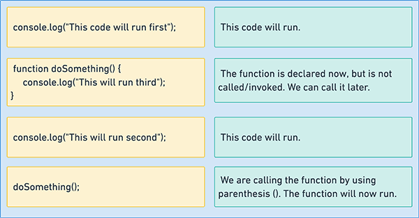

# Lesson 4: Functions

## Introduction

Understanding functions is very important. It is often a source of confusion to students new to JavaScript to see functions all over the
code and not understand what they are used for.

Functions are code that does a certain thing, that performs a particular task. We can perform the same task multiple times by calling a function multiple times.

When JavaScript code gets loaded in the browser, the browser will run the code as it finds it, from top to bottom.

As soon as the browser encounters this code it will run:

```js
console.log("hello");
```

A lot of the time we don't want our code to run immediately, but at a later time. This is another use case for functions.

## Instructions

Use one of the ways outlined in [lesson 1](lesson-2.md) to follow along and run the code in the examples.

## Our first function

To use a function, we first need to declare it. Declaring a function means writing the code for what we want it to do. We use the `function` keyword and a name of our choice to declare it.

```js
// declare the function
function logHello() {
    // the code we want the function to run goes here
}
```

Above, we've declared a function called `logHello`. Like other variables, functions can be called anything. **_Give your functions meaningful names_**, though, functions called `hi` or `function1` are not well-named functions.

The contents of a function live between the curly braces `{ }`. We don't have any code there except a comment so our function doesn't do anything at the moment. We will look at the purpose of the parenthesis (round brackets) `()` later in the lesson.

Let's make our function do something, a simple console log statement:

```js
function logHello() {
    console.log("hello");
}
```

Once we've written the function, we need to `call` (or `execute` or `invoke`) it. Without calling the function, the code inside it won't run. The JavaScript engine knows about it, but won't execute it.

We call a function using its name and parenthesis.

```js
logHello();
```

> Notice that we **_don't_** use the `function` keyword to call the function. We only use the `function` keyword when we are declaring the function.

Now the `logHello` function will run and log "Hello" to the browser console.



## Arguments

Most of the time we want to pass variables into our functions so that the code inside the function can use them.

When we use `console.log`, we are passing a `string` variable into the `log` function. The `log` function then prints that variable out.

```js
console.log("I am an argument");
```

The variables that we pass in to functions are called arguments. When we declare the function we can call the argument(s) whatever we want:

```js
// declare the function
// this function has no argument
function logHello() {
    console.log("Hello");
}
```

// call (execute) the function
sayHello();

// declare a function with one argument
// arguments can be
function withAnArgument(message) {
console.log(message);
}

// call the function
withAnArgument("this is an argument version 2")

function addNumbers(number1, number2) {
var sum = number1 + number2;
// console.log(sum);
}

addNumbers(10, 5);

function withAFunction(callbackFunction) {
callbackFunction();
}

// withAFunction(sayHello);

function customEventListener(whatToListenFor, theFunctionToCall) {

    // console.log("whatToListenFor", whatToListenFor)

    if(whatToListenFor === "click") {
        theFunctionToCall()
    }

}

customEventListener("click", sayHello)

var myButton = document.getElementById("button");

myButton.addEventListener("mouseover", doWhenButtonClicked)

function doWhenButtonClicked() {
alert("yes Hello1");
}
